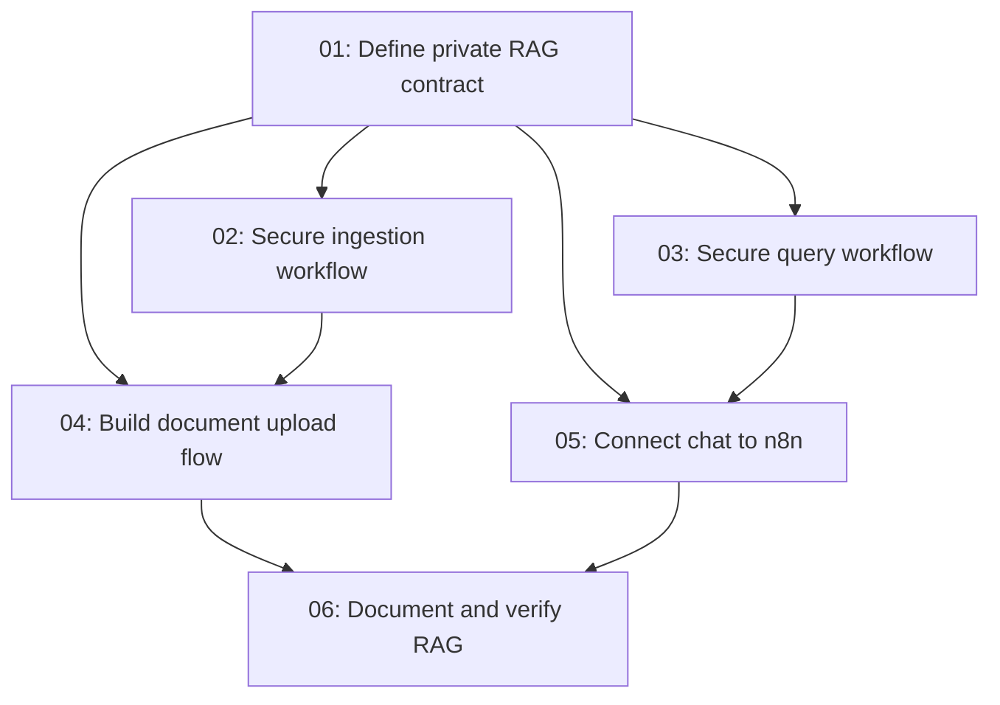

# Private Document RAG

## Overview

Replace the starter text/URL and local full-text RAG paths with private, user-scoped file ingestion and n8n-backed Qdrant retrieval. Authenticated users upload supported documents, observe asynchronous ingestion status, and ask questions in the chat UI; every ingestion, vector query, and deletion is constrained to the signed-in user.

## Quick Links

- [Requirements](./requirements.md) - full requirements and acceptance criteria
- [Action Required](./action-required.md) - manual service configuration

## Dependency Graph

## Waves

| Wave | Tasks | Description |
| --- | --- | --- |
| 1 | task-01 | Establish the database and server-to-n8n contract. |
| 2 | task-02, task-03 | Build isolated ingestion and retrieval workflows in parallel. |
| 3 | task-04, task-05 | Integrate document upload and chat UI paths in parallel. |
| 4 | task-06 | Document the operational flow and run end-to-end verification. |

## Task Status

### Wave 1
- [x] [task-01-private-rag-contract](./tasks/task-01-private-rag-contract.md) - Define durable document records and authenticated contracts.

### Wave 2
- [x] [task-02-secure-ingestion-workflow](./tasks/task-02-secure-ingestion-workflow.md) - Activate a private n8n ingestion workflow.
- [x] [task-03-secure-query-workflow](./tasks/task-03-secure-query-workflow.md) - Create a private Qdrant query workflow.

### Wave 3
- [x] [task-04-document-upload-flow](./tasks/task-04-document-upload-flow.md) - Replace text/URL sources with file uploads and status polling.
- [x] [task-05-n8n-chat-integration](./tasks/task-05-n8n-chat-integration.md) - Route chat answers and citations through n8n.

### Wave 4
- [x] [task-06-document-and-verify](./tasks/task-06-document-and-verify.md) - Record architecture and verify the full private RAG flow.
